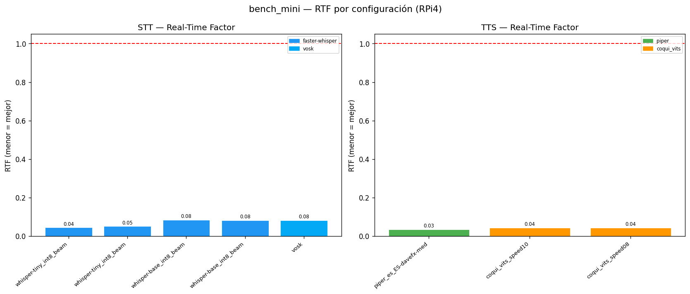
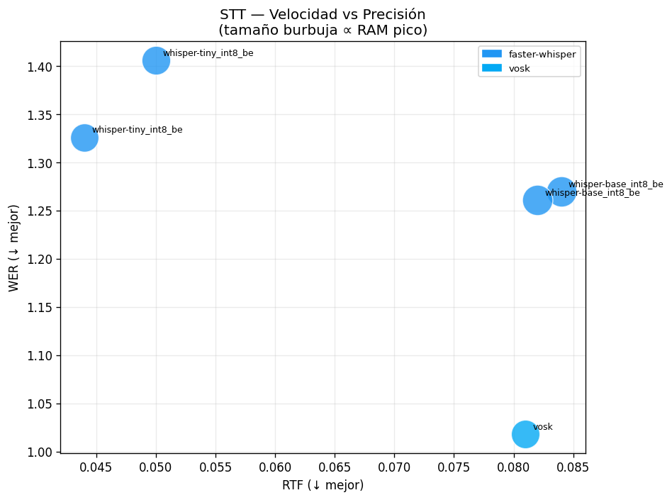
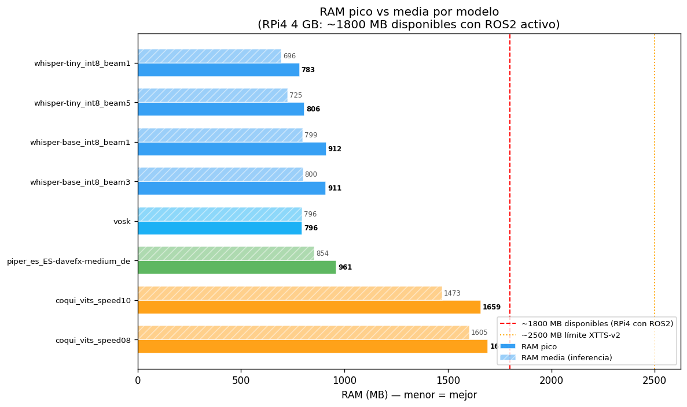
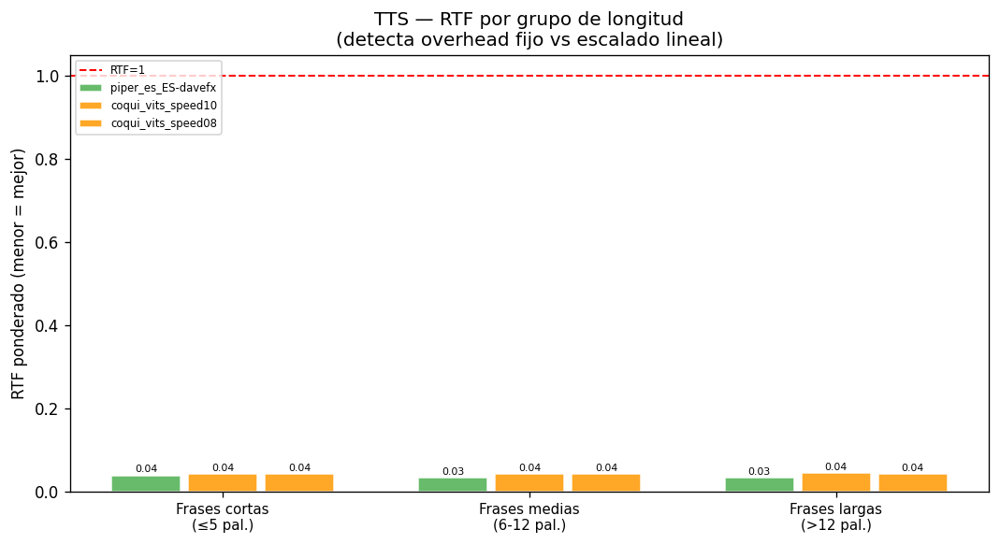
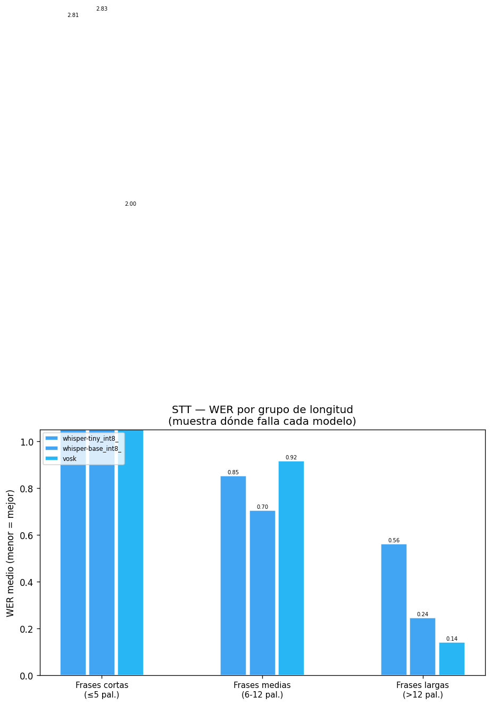

# bench_mini — Informe Benchmark Representativo RPi4

**Fecha:** 2026-05-16 19:13:03  
**Plataforma:** x86_64 — Linux 6.17.0-29-generic  
**CPU cores:** 8  
**RAM total:** 15687.3 MB | RAM libre inicio: 9143.6 MB  

## Metodología

- N_REPS=3 (rep 0 = warmup descartado; 2 medida(s) válida(s))
- Corpus STT: 9 frases (3 cortas / 3 medias / 3 largas) — mismas del bench exhaustivo.
- Corpus TTS: 9 frases del CORPUS_MINI.
- RTF ponderado: Σtiempos / Σduraciones.
- WER STT: diacríticos eliminados antes de comparar (normalizar()).
- WER TTS: Whisper tiny ES sobre los WAVs generados (si --no-quality, se omite).
- Cooldown térmico entre configs (esperar <55°C).

## STT — Resultados

| Config | WER | RTF±std | Carga(s) | RAM(MB) | CPU%pico | Throttle |
| --- | --- | --- | --- | --- | --- | --- |
| whisper-tiny_int8_beam1 | 1.326 | 0.044±0.004 | 0.17 | 783.3 | 100.0 | N/A |
| whisper-tiny_int8_beam5 | 1.406 | 0.05±0.003 | 0.15 | 806.4 | 100.0 | N/A |
| whisper-base_int8_beam1 | 1.27 | 0.084±0.006 | 0.2 | 911.6 | 100.0 | N/A |
| whisper-base_int8_beam3 | 1.261 | 0.082±0.012 | 0.2 | 910.7 | 100.0 | N/A |
| vosk | 1.018 | 0.081±0.003 | 0.21 | 795.8 | 15.0 | N/A |

## TTS — Resultados

| Config | Motor | RTF±std | Carga(s) | RAM(MB) | TTFB(s)* | WER | CPU%pico | Throttle |
| --- | --- | --- | --- | --- | --- | --- | --- | --- |
| piper_es_ES-davefx-medium | piper | 0.034±0.0069 | 0.92 | 960.7 | 0.097 | 0.2784 | 100.0 | N/A |
| coqui_vits_speed10 | coqui_vits | 0.043±0.0025 | 0.27 | 1659.4 | — | 0.2621 | 100.0 | N/A |
| coqui_vits_speed08 | coqui_vits | 0.043±0.0033 | 0.22 | 1694.6 | — | 0.2437 | 52.3 | N/A |

> \* TTFB real solo Piper (streaming). Coqui/Kitten: latencia total.

## Gráficas

