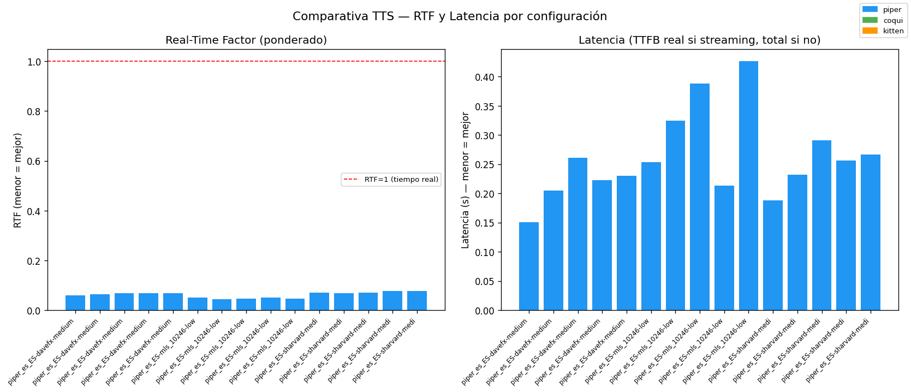
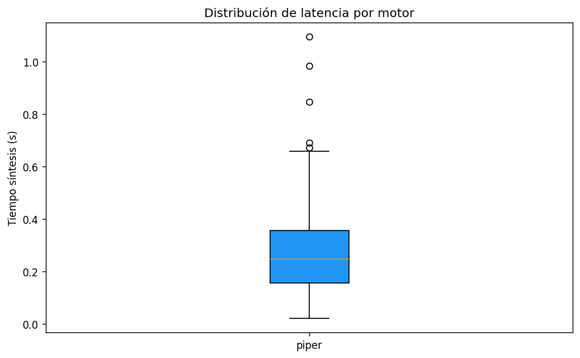
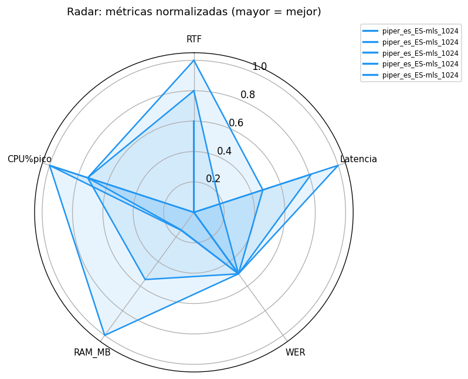

# Informe Benchmark TTS Afectivo

**Fecha:** 2026-04-19 19:33:48  
**Plataforma:** aarch64 — Linux 5.15.0-1098-raspi  
**CPU cores:** 4  
**RAM total:** 3789.8 MB  

## Metodología

- **N_REPS:** 5 (primera repetición descartada como warmup; 4 medidas válidas)
- **Corpus:** 15 frases — 5 cortas (≤5 pal.), 5 medias (6-12 pal.), 5 largas (>12 pal.).
- **RTF:** ponderado por duración — `Σsynthesis_times / Σaudio_durations` (no media de medias).
- **std:** desviación estándar de TODAS las observaciones individuales (no media de stds por frase).
- **TTFB:** Time to First Byte — real solo en Piper (streaming). Coqui/Kitten no tienen streaming: se muestra `-` y se usa `tiempo_sintesis_s` como latencia.
- **CPU%:** monitorizado continuamente cada 50 ms durante la síntesis.
- **Throttling (RPi4):** bitmask de `/sys/.../get_throttled` registrado antes/después de cada config.
- **WER:** calculado con Whisper tiny ES (normalización unicode + edit-distance).
- **UTMOS:** pendiente cálculo offline con los WAVs generados si `utmos` no disponible.

## Tabla resumen

| Config | Motor | Carga(s) | RAM(MB) | RTF±std | TTFB(s)* | P50(s) | P95(s) | WER | CPU%pico | Throttle | Temp_pico(°C) |
| --- | --- | --- | --- | --- | --- | --- | --- | --- | --- | --- | --- |
| piper_es_ES-davefx-medium_expr | piper | 5.39 | 522.6 | 0.576±0.0247 | 1.8267 | 1.6461 | 3.2346 | N/A | 87.0 | 0x80000 | 83.3 |
| piper_es_ES-davefx-medium_neut | piper | 5.39 | 569.0 | 0.579±0.0173 | 1.9668 | 1.7691 | 3.5578 | N/A | 87.0 | 0x80008 | 83.3 |
| piper_es_ES-davefx-medium_paus | piper | 5.39 | 577.8 | 0.565±0.0156 | 2.1182 | 1.8834 | 3.7955 | N/A | 86.9 | 0x80008 | 82.8 |
| piper_es_ES-mls_10246-low_expr | piper | 5.02 | 777.6 | 0.386±0.0733 | 2.7034 | 2.5866 | 4.5696 | N/A | 87.2 | 0x80008 | 83.3 |
| piper_es_ES-mls_10246-low_neut | piper | 5.02 | 792.0 | 0.378±0.1305 | 2.6708 | 2.7629 | 4.047 | N/A | 84.7 | 0x80008 | 83.8 |
| piper_es_ES-mls_10246-low_paus | piper | 5.02 | 790.9 | 0.44±0.097 | 2.252 | 2.3408 | 3.463 | N/A | 84.7 | 0x80008 | 82.8 |
| piper_es_ES-sharvard-medium_ex | piper | 5.35 | 630.8 | 0.566±0.0281 | 1.9258 | 1.782 | 3.3785 | N/A | 84.8 | 0x80000 | 83.3 |
| piper_es_ES-sharvard-medium_ne | piper | 5.35 | 635.9 | 0.561±0.0275 | 2.0618 | 1.8863 | 3.6566 | N/A | 87.1 | 0x80008 | 82.3 |
| piper_es_ES-sharvard-medium_pa | piper | 5.35 | 630.4 | 0.546±0.0222 | 2.2996 | 2.0585 | 4.1389 | N/A | 84.6 | 0x80008 | 83.3 |
| coqui_vits_speed10 | coqui | 4.03 | 1209.4 | 1.001±0.0629 | - | 4.5771 | 7.1914 | N/A | 84.6 | 0x0 | 78.4 |
| coqui_vits_speed08 | coqui | 1.92 | 1369.6 | 1.011±0.0475 | - | 4.4974 | 7.4522 | N/A | 84.6 | 0x0 | 78.9 |
| coqui_vits_fallback | coqui | 1.68 | 1524.5 | 1.0±0.0518 | - | 4.5932 | 7.4454 | N/A | 84.6 | 0x0 | 78.9 |

> \* TTFB real solo para motores con streaming (Piper). Para Coqui/KittenTTS el tiempo de latencia es `tiempo_sintesis_s` (ver P50/P95).

## Gráficas

### rtf_ttfb_barras.png

### boxplot_latencias.png

### radar_metricas.png

## RTF por grupo de longitud de frase

Detecta si un motor penaliza desproporcionadamente frases largas o tiene un coste fijo de arranque alto.

### piper_es_ES-davefx-medium_expresivo_rapi (piper)

| Grupo | N frases | RTF | T.medio±std (s) | P50(s) | P95(s) |
| --- | --- | --- | --- | --- | --- |
| corta | 5 | 0.581 | 0.868±0.2339 | 0.939 | 1.0828 |
| media | 5 | 0.597 | 1.651±0.2966 | 1.685 | 2.0126 |
| larga | 5 | 0.563 | 2.973±0.2341 | 2.873 | 3.2392 |

### piper_es_ES-davefx-medium_neutral (piper)

| Grupo | N frases | RTF | T.medio±std (s) | P50(s) | P95(s) |
| --- | --- | --- | --- | --- | --- |
| corta | 5 | 0.59 | 0.947±0.25 | 1.026 | 1.188 |
| media | 5 | 0.565 | 1.689±0.2424 | 1.818 | 1.9176 |
| larga | 5 | 0.583 | 3.277±0.2166 | 3.185 | 3.5448 |

### piper_es_ES-davefx-medium_pausado_suave (piper)

| Grupo | N frases | RTF | T.medio±std (s) | P50(s) | P95(s) |
| --- | --- | --- | --- | --- | --- |
| corta | 5 | 0.574 | 1.037±0.2663 | 1.197 | 1.2652 |
| media | 5 | 0.564 | 1.851±0.2685 | 1.933 | 2.1398 |
| larga | 5 | 0.563 | 3.479±0.2246 | 3.388 | 3.7636 |

### piper_es_ES-mls_10246-low_expresivo_rapi (piper)

| Grupo | N frases | RTF | T.medio±std (s) | P50(s) | P95(s) |
| --- | --- | --- | --- | --- | --- |
| corta | 5 | 0.346 | 2.913±1.5847 | 3.254 | 4.775 |
| media | 5 | 0.413 | 2.533±0.5418 | 2.657 | 3.1714 |
| larga | 5 | 0.414 | 2.679±0.1966 | 2.623 | 2.9354 |

### piper_es_ES-mls_10246-low_neutral (piper)

| Grupo | N frases | RTF | T.medio±std (s) | P50(s) | P95(s) |
| --- | --- | --- | --- | --- | --- |
| corta | 5 | 0.302 | 2.549±1.1914 | 3.054 | 3.6702 |
| media | 5 | 0.403 | 2.64±0.1722 | 2.643 | 2.825 |
| larga | 5 | 0.455 | 2.838±0.199 | 2.741 | 3.07 |

### piper_es_ES-mls_10246-low_pausado_suave (piper)

| Grupo | N frases | RTF | T.medio±std (s) | P50(s) | P95(s) |
| --- | --- | --- | --- | --- | --- |
| corta | 5 | 0.416 | 2.086±1.0495 | 2.137 | 3.1184 |
| media | 5 | 0.442 | 1.867±0.2364 | 1.827 | 2.1792 |
| larga | 5 | 0.458 | 2.815±0.0981 | 2.803 | 2.928 |

### piper_es_ES-sharvard-medium_expresivo_ra (piper)

| Grupo | N frases | RTF | T.medio±std (s) | P50(s) | P95(s) |
| --- | --- | --- | --- | --- | --- |
| corta | 5 | 0.589 | 0.871±0.2313 | 0.931 | 1.0874 |
| media | 5 | 0.569 | 1.703±0.2542 | 1.808 | 1.9478 |
| larga | 5 | 0.559 | 3.216±0.1498 | 3.173 | 3.4194 |

### piper_es_ES-sharvard-medium_neutral (piper)

| Grupo | N frases | RTF | T.medio±std (s) | P50(s) | P95(s) |
| --- | --- | --- | --- | --- | --- |
| corta | 5 | 0.594 | 0.94±0.2824 | 0.933 | 1.2302 |
| media | 5 | 0.57 | 1.841±0.2699 | 1.915 | 2.1416 |
| larga | 5 | 0.549 | 3.416±0.1953 | 3.308 | 3.6516 |

### piper_es_ES-sharvard-medium_pausado_suav (piper)

| Grupo | N frases | RTF | T.medio±std (s) | P50(s) | P95(s) |
| --- | --- | --- | --- | --- | --- |
| corta | 5 | 0.572 | 1.041±0.295 | 1.053 | 1.3388 |
| media | 5 | 0.541 | 2.022±0.2642 | 2.063 | 2.3204 |
| larga | 5 | 0.542 | 3.848±0.2605 | 3.695 | 4.2082 |

### coqui_vits_speed10 (coqui)

| Grupo | N frases | RTF | T.medio±std (s) | P50(s) | P95(s) |
| --- | --- | --- | --- | --- | --- |
| corta | 5 | 0.968 | 2.842±0.4989 | 2.794 | 3.3904 |
| media | 5 | 1.011 | 4.531±0.4766 | 4.501 | 5.012 |
| larga | 5 | 1.01 | 6.944±0.1963 | 6.999 | 7.142 |

### coqui_vits_speed08 (coqui)

| Grupo | N frases | RTF | T.medio±std (s) | P50(s) | P95(s) |
| --- | --- | --- | --- | --- | --- |
| corta | 5 | 0.967 | 2.915±0.5027 | 2.784 | 3.5392 |
| media | 5 | 0.982 | 4.542±0.4676 | 4.455 | 5.0416 |
| larga | 5 | 1.05 | 7.08±0.3005 | 7.092 | 7.3926 |

### coqui_vits_fallback (coqui)

| Grupo | N frases | RTF | T.medio±std (s) | P50(s) | P95(s) |
| --- | --- | --- | --- | --- | --- |
| corta | 5 | 0.939 | 3.021±0.4672 | 2.897 | 3.6202 |
| media | 5 | 0.987 | 4.508±0.5097 | 4.648 | 4.9852 |
| larga | 5 | 1.038 | 7.103±0.3057 | 7.218 | 7.3746 |

## Notas de implementación

- **RTF ponderado:** `Σtiempos / Σduraciones` — no afectado por el peso de frases cortas.
- **std global:** calculado sobre todas las observaciones individuales, no promediando stds.
- **WER propio vs jiwer:** implementación simple sin dependencia extra.
- **UTMOS:** speechmos → torch.hub → stub offline (en ese orden de preferencia).
- **TTFB real solo en Piper:** Coqui/Kitten no exponen streaming estable.
- **Fallback XTTS→VITS:** automático si RAM libre < 2.5 GB.
- **Throttling:** bitmask 0x0 = sistema sano; >0 indica bajo voltaje o limitación de frecuencia.
- **Métricas acústicas:** F0 (YIN, frames con energía>umbral), RMS global, tempo silábico (picos 30ms).

## Conclusiones automáticas

RTF estimado en RPi4 = mejor RTF observado × 4.0 (factor empírico PC→RPi4).

| Motor | RTF_est_RPi4 | Viable_RPi4 | RAM_OK (<1500 MB) | F0_rango_medio | Recomendación |
|-------|-------------|-------------|-------------------|---------------|---------------|
| piper | 1.512 | No | Sí | 279.0 Hz | Usar solo en PC; evaluar cuantización |
| coqui | 4.0 | No | No | 272.8 Hz | Inviable en RPi4 con Nav2 activo |
