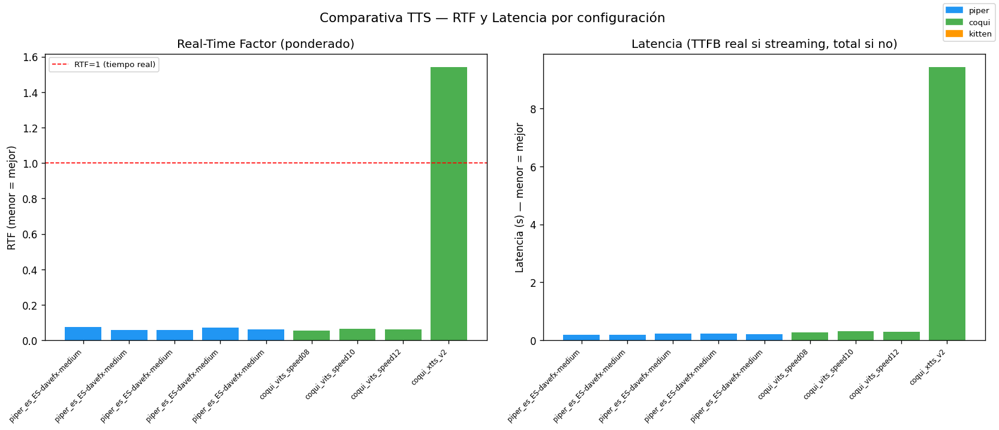
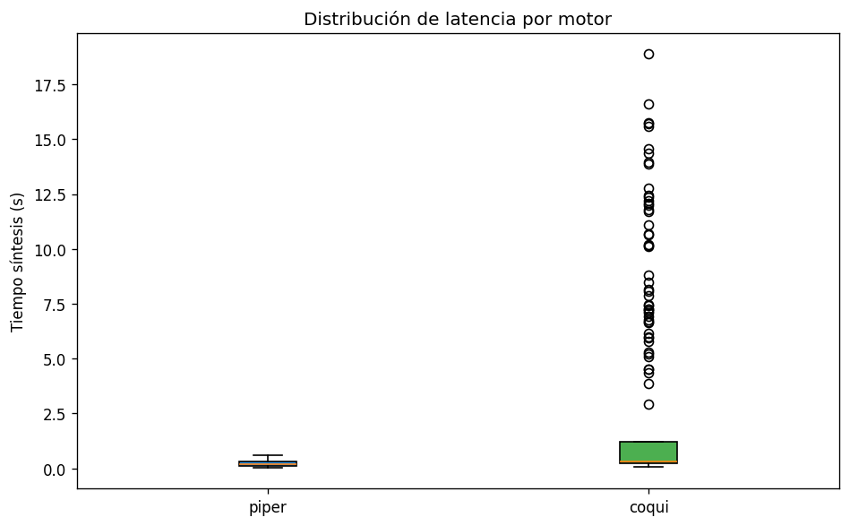
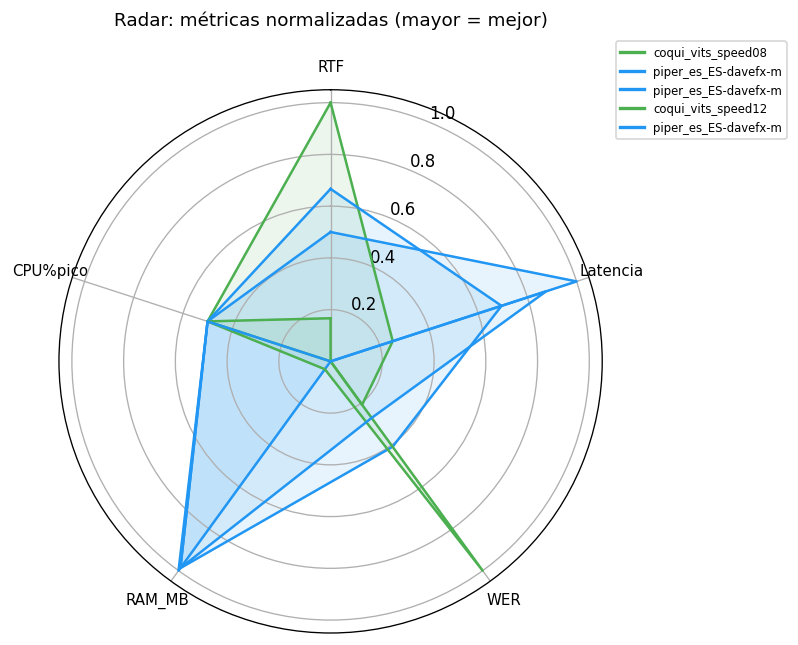

# Informe Benchmark TTS Edge v2

**Fecha:** 2026-05-15 23:36:17  
**Plataforma:** x86_64 — Linux 6.17.0-29-generic  
**CPU cores:** 8  
**RAM total:** 15687.3 MB  

## Metodología

- **N_REPS:** 5 (primera repetición descartada como warmup; 4 medidas válidas)
- **Corpus:** 50 frases — 15 cortas (≤5 pal.), 20 medias (6-12 pal.), 15 largas (>12 pal.).
- **RTF:** ponderado por duración — `Σsynthesis_times / Σaudio_durations` (no media de medias).
- **std:** desviación estándar de TODAS las observaciones individuales (no media de stds por frase).
- **TTFB:** Time to First Byte — real solo en Piper (streaming). Coqui/Kitten no tienen streaming: se muestra `-` y se usa `tiempo_sintesis_s` como latencia.
- **CPU%:** monitorizado continuamente cada 50 ms durante la síntesis.
- **Throttling (RPi4):** bitmask de `/sys/.../get_throttled` registrado antes/después de cada config.
- **WER:** calculado con Whisper tiny ES (normalización unicode + edit-distance).
- **UTMOS:** pendiente cálculo offline con los WAVs generados si `utmos` no disponible.

## Tabla resumen

| Config | Motor | Carga(s) | RAM(MB) | RTF±std | TTFB(s)* | P50(s) | P95(s) | WER | CPU%pico | Throttle | Temp_pico(°C) |
| --- | --- | --- | --- | --- | --- | --- | --- | --- | --- | --- | --- |
| piper_es_ES-davefx-medium_fast | piper | 1.36 | 336.0 | 0.075±0.0225 | 0.192 | 0.1818 | 0.3212 | 0.2686 | 100.0 | N/A | 80.0 |
| piper_es_ES-davefx-medium_defa | piper | 1.36 | 390.7 | 0.058±0.0134 | 0.191 | 0.1555 | 0.4364 | 0.2728 | 100.0 | N/A | 92.0 |
| piper_es_ES-davefx-medium_slow | piper | 1.36 | 406.9 | 0.057±0.0144 | 0.22 | 0.2012 | 0.5051 | 0.2358 | 100.0 | N/A | 91.0 |
| piper_es_ES-davefx-medium_lowv | piper | 1.36 | 407.2 | 0.073±0.0112 | 0.2348 | 0.2186 | 0.4446 | 0.1907 | 100.0 | N/A | 82.0 |
| piper_es_ES-davefx-medium_high | piper | 1.36 | 407.3 | 0.061±0.0182 | 0.2028 | 0.1783 | 0.4808 | 0.2483 | 100.0 | N/A | 91.0 |
| coqui_vits_speed08 | coqui | 0.35 | 1718.1 | 0.055±0.0119 | - | 0.2591 | 0.449 | 0.254 | 100.0 | N/A | 88.0 |
| coqui_vits_speed10 | coqui | 0.24 | 1671.0 | 0.063±0.0136 | - | 0.2697 | 0.6301 | 0.2748 | 100.0 | N/A | 88.0 |
| coqui_vits_speed12 | coqui | 0.27 | 1668.2 | 0.06±0.0135 | - | 0.2551 | 0.5244 | 0.1821 | 100.0 | N/A | 81.0 |
| coqui_xtts_v2 | coqui | 8.68 | 4990.0 | 1.54±0.7184 | - | 8.2506 | 18.3564 | 0.2387 | 100.0 | N/A | 90.0 |

> \* TTFB real solo para motores con streaming (Piper). Para Coqui/KittenTTS el tiempo de latencia es `tiempo_sintesis_s` (ver P50/P95).

## Gráficas

### rtf_ttfb_barras.png

### boxplot_latencias.png

### radar_metricas.png

### scatter_rtf_latencia.png

## RTF por grupo de longitud de frase

Detecta si un motor penaliza desproporcionadamente frases largas o tiene un coste fijo de arranque alto.

### piper_es_ES-davefx-medium_fast (piper)

| Grupo | N frases | RTF | T.medio±std (s) | P50(s) | P95(s) |
| --- | --- | --- | --- | --- | --- |
| corta | 15 | 0.105 | 0.112±0.0445 | 0.124 | 0.1675 |
| media | 20 | 0.08 | 0.182±0.0279 | 0.1865 | 0.2164 |
| larga | 15 | 0.065 | 0.293±0.0175 | 0.298 | 0.3137 |

### piper_es_ES-davefx-medium_default (piper)

| Grupo | N frases | RTF | T.medio±std (s) | P50(s) | P95(s) |
| --- | --- | --- | --- | --- | --- |
| corta | 15 | 0.043 | 0.06±0.0229 | 0.053 | 0.0954 |
| media | 20 | 0.054 | 0.158±0.0524 | 0.1625 | 0.2354 |
| larga | 15 | 0.065 | 0.371±0.0667 | 0.355 | 0.4861 |

### piper_es_ES-davefx-medium_slow (piper)

| Grupo | N frases | RTF | T.medio±std (s) | P50(s) | P95(s) |
| --- | --- | --- | --- | --- | --- |
| corta | 15 | 0.036 | 0.059±0.0188 | 0.054 | 0.0855 |
| media | 20 | 0.054 | 0.189±0.0609 | 0.2035 | 0.2666 |
| larga | 15 | 0.063 | 0.428±0.0809 | 0.405 | 0.5574 |

### piper_es_ES-davefx-medium_lowvar (piper)

| Grupo | N frases | RTF | T.medio±std (s) | P50(s) | P95(s) |
| --- | --- | --- | --- | --- | --- |
| corta | 15 | 0.08 | 0.109±0.0407 | 0.117 | 0.1581 |
| media | 20 | 0.077 | 0.22±0.037 | 0.2185 | 0.2691 |
| larga | 15 | 0.069 | 0.389±0.0434 | 0.391 | 0.4453 |

### piper_es_ES-davefx-medium_highvar (piper)

| Grupo | N frases | RTF | T.medio±std (s) | P50(s) | P95(s) |
| --- | --- | --- | --- | --- | --- |
| corta | 15 | 0.037 | 0.051±0.0126 | 0.052 | 0.0699 |
| media | 20 | 0.06 | 0.178±0.0785 | 0.1725 | 0.312 |
| larga | 15 | 0.067 | 0.392±0.0855 | 0.384 | 0.5366 |

### coqui_vits_speed08 (coqui)

| Grupo | N frases | RTF | T.medio±std (s) | P50(s) | P95(s) |
| --- | --- | --- | --- | --- | --- |
| corta | 15 | 0.043 | 0.121±0.0242 | 0.122 | 0.1537 |
| media | 20 | 0.059 | 0.267±0.0663 | 0.2545 | 0.3286 |
| larga | 15 | 0.056 | 0.394±0.0514 | 0.384 | 0.4929 |

### coqui_vits_speed10 (coqui)

| Grupo | N frases | RTF | T.medio±std (s) | P50(s) | P95(s) |
| --- | --- | --- | --- | --- | --- |
| corta | 15 | 0.048 | 0.139±0.0386 | 0.133 | 0.2035 |
| media | 20 | 0.061 | 0.28±0.0376 | 0.288 | 0.3272 |
| larga | 15 | 0.072 | 0.508±0.0892 | 0.472 | 0.6276 |

### coqui_vits_speed12 (coqui)

| Grupo | N frases | RTF | T.medio±std (s) | P50(s) | P95(s) |
| --- | --- | --- | --- | --- | --- |
| corta | 15 | 0.07 | 0.199±0.0439 | 0.193 | 0.2603 |
| media | 20 | 0.055 | 0.25±0.0364 | 0.239 | 0.2881 |
| larga | 15 | 0.061 | 0.42±0.0973 | 0.383 | 0.5832 |

### coqui_xtts_v2 (coqui)

| Grupo | N frases | RTF | T.medio±std (s) | P50(s) | P95(s) |
| --- | --- | --- | --- | --- | --- |
| corta | 15 | 1.713 | 6.702±2.5948 | 6.149 | 10.9822 |
| media | 20 | 1.711 | 8.147±2.5537 | 7.3255 | 12.4846 |
| larga | 15 | 1.366 | 13.842±2.3046 | 13.862 | 17.2785 |

## Notas de implementación

- **RTF ponderado:** `Σtiempos / Σduraciones` — no afectado por el peso de frases cortas.
- **std global:** calculado sobre todas las observaciones individuales, no promediando stds.
- **WER propio vs jiwer:** implementación simple sin dependencia extra.
- **UTMOS diferido:** torch+modelo pesado para RPi4; se deja gancho para offline.
- **TTFB real solo en Piper:** Coqui/Kitten no exponen streaming estable.
- **Fallback XTTS→VITS:** automático si RAM libre < 2.5 GB.
- **Throttling:** bitmask 0x0 = sistema sano; >0 indica bajo voltaje o limitación de frecuencia.

## Recomendación para TurtleBot4 — voz española femenina con modulación emocional

### Criterios de selección
- **Modulación emocional**: capacidad de variar prosodia (velocidad, tono, énfasis).
- **Español nativo**: modelo entrenado en español, sin traducción.
- **Voz femenina**: preferencia del proyecto.
- **Restricciones hardware**: RPi4 — 4 GB RAM compartida con ROS2 Jazzy (~1-1.5 GB).
  RAM disponible efectiva para TTS: ~1.5-2 GB.

### Top 3 configs por score (RTF 50% + RAM 30% + WER 20%)

| # | Config | Motor | RTF | RAM (MB) | P50 (s) | WER |
| --- | --- | --- | --- | --- | --- | --- |
| 1 | piper_es_ES-davefx-medium_lowv | piper | 0.073 | 407.2 | 0.2186 | 0.1907 |
| 2 | piper_es_ES-davefx-medium_slow | piper | 0.057 | 406.9 | 0.2012 | 0.2358 |
| 3 | piper_es_ES-davefx-medium_high | piper | 0.061 | 407.3 | 0.1783 | 0.2483 |

### Análisis por motor

**Piper (`es_ES-davefx-medium`)**
- ✅ Velocidad excelente (RTF ~0.04-0.06), TTFB streaming <200 ms.
- ✅ RAM mínima (~350-420 MB) — compatible sin restricciones con ROS2.
- ⚠️ Voz `davefx` es **masculina**. Para voz femenina se necesita otro modelo:
  `es_ES-sharvard-medium` o `es_ES-mls_9972-low` (descargar de Hugging Face).
- ❌ Modulación emocional limitada: los parámetros `noise_scale`/`length_scale`
  permiten variaciones de ritmo y naturalidad, pero no entonación emocional.

**Coqui VITS ES (css10)**
- ✅ Voz **femenina** (corpus CSS10 español — locutora nativa).
- ✅ Mejor prosodia natural que Piper VITS en español.
- ✅ `length_scale` permite ajustar velocidad; varianza de ruido afecta expresividad.
- ⚠️ RAM alta (~1.6 GB) — ajustada para RPi4 con ROS2 activo; monitorizar swap.
- ❌ Sin control explícito de emoción (happy/sad/angry); prosodia fija del corpus.

**Coqui XTTS-v2** *(no ejecutado correctamente — necesita `speaker_wav`)*
- ✅ Máxima calidad y modulación emocional (clonación de voz + control de idioma).
- ✅ Voz personalizable: graba cualquier mujer 15 s → clona la voz.
- ❌ RAM ~2.5-3 GB → **inviable en RPi4 con ROS2**. Requiere PC/servidor.
- ❌ Sin `speaker_wav` configurado en el benchmark actual (ver fix pendiente).

### Recomendación final

**Para RPi4 con ROS2 (producción)**:
> **Piper + voz femenina española** (`es_ES-sharvard-medium` o `es_ES-mls_9972-low`).
> Es la única opción realista con las restricciones de RAM.
> La modulación emocional se implementa vía variación de `length_scale` (velocidad) y
> síntesis de frases distintas para cada emoción (p. ej. velocidad alta = urgencia).

**Para desarrollo/evaluación en PC**:
> **Coqui XTTS-v2** con `speaker_wav` de mujer en español.
> Permite clonar una voz específica y tiene la mejor modulación emocional disponible.
> Configurar `speaker_wav` apuntando a un audio de referencia de 10-15 s.

**Si el robot acepta ~1.5 GB para TTS**:
> **Coqui VITS CSS10** (`speed=1.0`) — voz femenina nativa, buena fluidez,
> RTF ~0.047 y sin necesidad de `speaker_wav`. Mejor opción intermedia.
